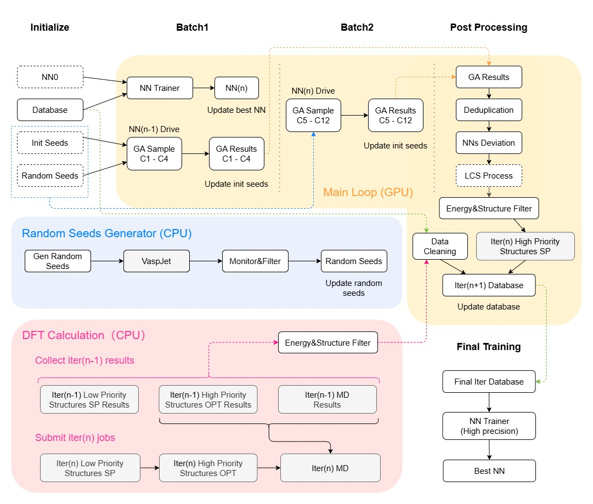

# Hiccup

Version 2.0

Genetic Algorithm-Driven Neural Network Potential Trainer.

## 软件介绍

### 1. workflow流程图



## 安装指南

```
git clone https://gitee.com/ccccissy/Hiccup.git
pip install .
```

## 使用方法

### 1. 输入文件说明

#### 1.1 template目录

##### （1）目录结构

```
-trainer
​	--deepmd_input.json
​	--deepmd_input_accurate.json
-uspex
​	--INCAR_1
​	--KPOINTS
​	--POTCAR_A
​	--POTCAR_B
​	--run_dp.sh
​	--run_mace.sh
​	--dp_opt.py
​	--mace_opt.py
​	--TEMP_INPUT_0.txt
​	--TEMP_INPUT_2.txt
​	--TEMP_INPUT_3.txt
-vaspjet
​	--pure_vasp_sp.yml
​	--pure_vasp_opt.yml
​	--pure_vasp_md.yml
```

##### （2）详细说明

**trainer目录：**

​	包括两个deepmd的输入文件。

​	`deepmd_input.json`：迭代过程中deepmd训练的输入文件。

​	`deepmd_input_accurate.json`：最后一次高精度deepmd训练的输入文件。

**uspex目录：**

​	包括vasp计算的基本输入文件：`INCAR_1`，`KPOINTS`，`POTCAR`等。虽然在本workflow中uspex并不用vasp驱动，但需要有基本的输入文件（其中的参数对计算没有影响），否则会uspex会报错。

​	`dp_opt.py`：用训练好的NN势作为计算器，输出能量和力的信息，可根据需求编译。

​	`mace_opt.py`：用通用势函数MACE作为计算器，输出能量和力的信息，可根据需求编译。

​	`run_dp.sh`：USPEX调用NN作为计算器的脚本，需要配置python3环境来执行dp_opt.py。

​	`run_mace.sh`：USPEX调用MACE作为计算器的脚本，需要配置python3环境来执行mace_opt.py。

​	`TEMP_INPUT_0.txt`：USPEX的输入文件模板，对应dimension=0，cluster结构搜索。

​	`TEMP_INPUT_2.txt`：USPEX的输入文件模板，对应dimension=2，surface结构搜索。

​	`TEMP_INPUT_3.txt`：USPEX的输入文件模板，对应dimension=3，bulk结构搜索。

**vaspjet目录：**

​	`pure_vasp_sp.yml`：vaspjet配置文件，对应单点能计算任务。

​	`pure_vasp_opt.yml`：vaspjet配置文件，对应优化计算任务。

​	`pure_vasp_md.yml`：vaspjet配置文件，对应MD计算任务。


#### 1.2 config.yml配置文件

##### （1）文件结构

```python
# 基础配置
BASE:
  Compositions: [[17, 40],[18,40],[19,40],[20,40],[21,40]] # 目标组分
  Elements: [O, Cu] # 元素列表
  Gpu: [0,1,2,3,4,5,6,7] # 可用GPU编号
  Iterations: 3 # 迭代次数
  Templates: /home/cchen/Train_NN/template # 模板路径
  Workdir: /home/cchen/Train_NN/example/slab/hiccup # 工作目录路径
# CPU配置
CPU:
  CPU IP: 202.120.101.188
  CPU Password: xxx
  CPU Port: 22
  CPU Username: materdesign
  CPU Working Directory: /home/materdesign/cc/test1
# 采样器配置
SAMPLING:
  GA:
    RANDOMSEEDS:
      Activate: True # 是否启用随机种子生成器，若不启用必须要有随机种子文件（False）
      Dimension: 3 # 0: cluster, 3: bulk
      Random Seeds Num: 20 # 随机种子数(100)
      Random Seeds Path: /home/cchen/Train_NN/example/slab/random_seeds.db # 随机种子路径
      Init Seeds Path: /home/cchen/Train_NN/example/slab/init_seeds.db # 初始种子路径
    USPEX:
      Dimension: 2 # 0:cluster, 2: surface, 3: bulk
      Generation Num: 3 # GA 代数
      Init Pop Size: 40 # 第一代中的种群数
      Pop Size: 40 # 每一代的种群数
      Calculator: DP # 计算器DP，MACE，默认MACE
      USPEX Env: /home/cchen/.conda/envs/uspex/bin # USPEX环境路径
      Substrate: /home/cchen/Train_NN/example/slab/POSCAR_SUBSTRATE # 基底结构
    POSTPROCESSING:
      # NNs评估器：accurate, candidate, failed
      Force Error Lower: 0.05
      Force Error Upper: 0.2
      # Energy&Force Filter, sp -> dft opt
      Max Filter Ratio: 0.8
      Max Filter Num: 50
      # 训练数据清洗：用最优模型清洗坏点
      Energy Filter: 0.1
      Force Filter: 2
      # lcs处理
      LCS Process: False # 是否进行LCS处理
      Type: slab # slab/cluster
      LCS Layers Num: 3 # lcs划分层数，针对slab
      LCS Radius: 5.0 # lcs半径，针对cluster
      # AIMD
      AIMD: True # 是否进行AIMD增加连续采样
      MD Max Filter Ratio: 0.2 # 需要MD采样的比例
      MD Max Filter Num: 10 # 需要MD采样的数量
      MD Init Data: /home/cchen/Train_NN/example/slab/init_md.db # MD初始数据路径
# 训练器配置
TRAINER:
  Deepmd:
    Data Path: /home/cchen/Train_NN/example/slab/init_database.db # 初始数据路径
    Initial Model: /home/cchen/Train_NN/slab/init_model.pb # 初始模型路径（None）
    Train Ratio: 0.9 # 训练集比例（0.8）
```

##### （2）详细说明

- **基础配置**
  
  - `Compositions`：列表，目标组成；
  - `Elements`：列表，目标元素，元素顺序要与组成列表中的顺序一致；
  - `Gpu`：列表，可用的GPU编号，至少要有4张卡；
  - `Iterations`：整数，总的迭代次数，不包括最后一次迭代；
  - `Templates`：字符串，模板目录路径；
  - `Workdir`：字符串，工作目录。
  
- **CPU配置**
  
  - `CPU IP`：字符串，CPU服务器的IP地址；
  - `CPU Password`：字符串，CPU服务器密码；
  - `CPU Port`：字符串，端口号；
  - `CPU Username`：字符串，用户名；
  - `CPU Working Directory`：字符串，CPU工作目录，最好是空目录。
  
- **采样器配置**

  目前只支持基因算法采样。

  随机种子生成器配置：

  - `Activate`：布尔值，是否启用随机种子生成器；
  - `Dimension`：整数，随机种子生成器采用Pyxtal生成随机结构，0对应cluster体系，3对应bulk体系；
  - `Random Seeds Num`：整数，每一种组分生成的随机结构数目，并不是随机种子结构的总数，默认值为100；
  - `Random Seeds Path`：字符串，随机种子结构文件路径，若不开启随机种子生成器，则需提供随机种子文件，以ase的db文件的形式传入，要求每个atoms对象的的key_value_pairs里有唯一的uid编号，key_value_pairs={'uid'='唯一uid编号'}；
  - `Init Seeds Path`：字符串，初始种子结构文件路径；

  USPEX配置

  - `Dimension`：整数，对应USPEX的搜索类型，1：cluster，2：surface，3：bulk；
  - `Generation Num`：整数，基因算法的代数；
  - `Init Pop Size`：整数，基因算法中第一代的种群数，默认值与`Pop Size`一致；
  - `Pop Size`：整数，基因算法中每一代中的种群数；
  - `Calculator`：字符串，计算器的选择，DP/MACE，默认MACE；
  - `USPEX Env`：字符串，USPEX python2 环境路径；
  - `Substrate`：字符串，基底文件路径，若进行surface体系的结构搜索需要提供基底文件；

  后处理参数配置

  4个模型分别对结构进行评估，根据对每个原子的受力评估结果将GA搜索得到的结构划分为accurate，candidate，failed三类。

  - `Force Error Lower`：浮点数，最大力偏差的下限，默认值0.1；
  - `Force Error Upper`：浮点数，最大力偏差的上限，默认值0.2；

  结构相似度评估筛选器参数，评估结构是否具有代表性，将所有待DFT打标的结构划分为高优先级结构和低优先级结构，分批进行计算。

  - `Max Filter Ratio`：浮点数，筛选得到的结构占总结构的百分比的上限，默认值0.8；
  - `Max Filter Num`：整数，筛选得到的结构总数的上限，默认值100；

  数据清洗器参数配置，用最优模型清洗坏点：

  - `Energy Filter`：浮点数，预测值与DFT计算值能量偏差上限，在模型质量比较差的时候可以适当调大，默认值0.1；
  - `Force Filter`：浮点数，预测值与DFT计算值的力偏差上限，在模型质量比较差的时候可以适当调大，默认值2；

  lcs处理参数配置：

  - `LCS Process`：布尔值，是否进行lcs处理，默认值False；
  - `Type`：字符串，slab/cluster，待处理的结构类型；
  - `LCS Layers Num`：整数，lcs对基底划分的层数，针对slab体系；
  - `LCS Radius`：浮点数，lcs处理的抠取半径，针对cluster体系；

  AIMD参数配置

  - `AIMD`：布尔值，是否进行MD连续采样；
  - `MD Max Filter Ratio`：浮点数，需要进行MD连续采样结构占总结构的最大比例，不宜太大；
  - `MD Max Filter Num`：整数，需要进行MD连续采样结构的最大数目，不宜太大；
  - `MD Init Data`：字符串，初始给定的需要MD采样的结构的db文件路径。

- **训练器配置**

  目前只支持Deepmd。

  - `Data Path`：字符串，初始数据集的路径，初始数据集要求以ase的db文件传入，要求row.data中包含energy和forces信息；
  - `Initial Model`：字符串，初始模型路径，默认值None；
  - `Train Ratio`：浮点数，训练集与测试集的比例划分，默认值0.8。

### 2.命令行使用说明

##### （1）运行Hiccup任务

```bash
hiccup run -yml config.yml 
# -yml: 配置文件*.yml路径
```

##### （2）模型性能评估

```bash
hiccup eva -db database.db -m model.pb -g gpu_id -e 0.1 -f 2 -n model_name
# -db: 数据库文件*.db路径
# -m: 待评估模型文件路径
# -g: GPU编号
# -e: 能量误差上限，默认值0.1
# -f: 力误差上限，默认值2
# -n: 模型名称，默认名称“Model”
```

